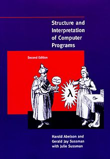

# my-sicp-solutions

My solutions SICP.

> Structure and Interpretation of Computer Programs (SICP) is a textbook aiming to teach the principles of computer programming, such as [abstraction](https://en.wikipedia.org/wiki/Abstraction_(computer_science)) in programming, [metalinguistic abstraction](https://en.wikipedia.org/wiki/Metalinguistic_abstraction), [recursion](https://en.wikipedia.org/wiki/Recursion), [interpreters](https://en.wikipedia.org/wiki/Interpreter_(computing)), and [modular programming](https://en.wikipedia.org/wiki/Modular_programming). 

See [more](https://en.wikipedia.org/wiki/Structure_and_Interpretation_of_Computer_Programs).